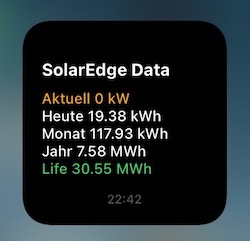

#### scriptable.solarEdge V1.0


# sonnenBatterie-Widget
Widget für die sonnenBatterien EC8.0/SB10

Download: [>>> hier](SonnenBatterieV1.0.js)

## Kurzbeschreibung
Das Widget für den SolarEdge-Wechselrichter liest ausgewählte Betriebsdaten über die API-Schnittstelle der Webseite "mySolarEdge" aus und stellt diese in einer Übersicht zur Verfügung. Das Script läuft mit Unterstützung der **App Scriptable** auf dem iPhone ab **iOS14**.

- **Aktuell** in kW, aktuelle Erzeugung einer PV-Anlage
- **Heute** in kWh, Erzeugung der PV-Anlage an diesem Tag (Tagessumme)
- **Monat** in kWh, Erzeugung der PV-Anlage in diesem Monat (Monatssumme)
- **Jahr** in kWh, Erzeugung der PV-Anlage an diesem Jahr (Jahressumme)
- **Life** in MWh, Erzeugung der PV-Anlage seit der Inbetriebnahme der Anlage (Totalsumme, Lebenszeit-Summe)

Zur Beachtung: Die Betriebsdaten des Wechselrichter werden auch angezeigt, wenn sich das iPhone nicht im Empfangsbereich des WLAN befindet.

## Settings, Parameter
Im Script sind in der oberen Zeile in der **APIurl** für den Zugriif auf den SolarEdge-Wechselrichter die beiden folgenden Parameter einzugeben:

**Anlagennummer:** - 999999, das ist die Anlagennummer des SE-Wechselrichters, die nach Freigabe in der Konfiguration der Webseite angezeigt wird
**Key:** - XXXXXXXXXXXXXXXXXXXXXXX, das ist der Sicherheitsschlüssel, den man auch der Konfigurationsseite des Wechselrichters entnehmen kann

## API-Schnittstelle

````APIurl = "https://monitoringapi.solaredge.com/site/999999/overview?api_key=XXXXXXXXXXXXXXXXXXXXXXXXXX"````

Die ausgelesenen Daten werden zur Anzeige gebracht, eine Speicherung der Daten durch das Widget, bspw. in einer Datenbank für die Visualisierung von Trends, erfolgt nicht.

Die folgenden JSON-Daten der Batterie werden verarbeitet:

##### JSON

````
{
...,
"Consumption_W":358,
...,
"GridFeedIn_W":5065,
...,
"Pac_total_W":-1031,
"Production_W":6458,
"USOC":58,
...
}
````
## Changelog

2020/11/11: sonnenBatterie V1.0 (Widget) init
